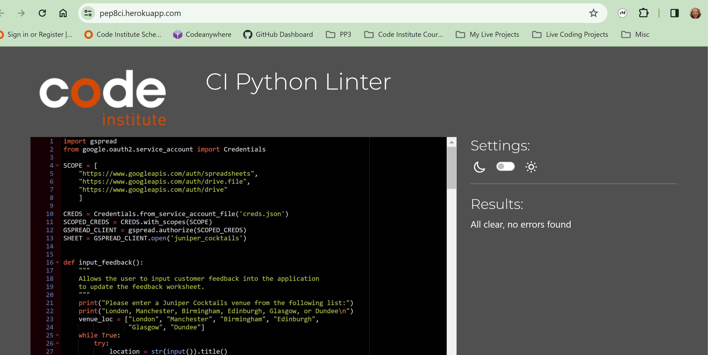

# Juniper Cocktails Customer Feedback Application

Juniper Cocktails is an imaginary chain of cocktail bar's operating at various locations across the UK.

The main purpose of this application is to allow a user (usually a franchisee owner or manager at one of Juniper Cocktails venues) to input customer feedback that will be recorded on a Google sheets feedback worksheet.  This feedback could be input in real-time by asking the customer specific questions while at the venue, or could be gathered and input from a paper-based survey completed by the customer before leaving the venue.

The secondary purpose of the application is to provide the user with information on how the input feedback compares to average feedback scores across all Juniper Cocktails venues.

Juniper Cocktails would like to maintain a certain level of consistency across their venues and the aim of this application is to allow franchisee owners or managers to input customer feedback and compare this feedback with the average feedback from across all venues.  This will allow owners or managers to ensure they are maintaining their feedback scores at an appropriate level, and improve upon underperforming areas where needed.  Use of this application by venues will also allow senior Juniper Cocktails stakeholders to examine and analyse feedback via the Google Sheets worksheets.

## User Stories

* As a User, I would like to be able to input customer feedback directly into the system, real-time, while the customer is still present at the venue.
* As a User, I would like to be able to input customer feedback from a paper-based survey completed by the customer before leaving the venue.
* As a User, I would like to be able to compare the customer feedback scores I input to the average scores, for each feedback criteria, for all Juniper Cocktails venues so that I can monitor where improvements might be needed.
* As a User, I would like the system to update Google Sheets worksheets so that senior Juniper Cocktails stakeholders can review and analyse the feedback to gain insights on where improvements may be needed.
* As a User, I would like to be able to input the customer's favourite cocktail recipe so that Juniper Cocktails can record this to ensure we never remove the most popular cocktails from our menu.

## Features

I originally created a rough flow chart diagram with pen and paper to decide what I wanted the application to do.  This flow chart diagram evolved over time as I decided to remove some features and add other features.  With CRUD operations in mind, I originally planned to add features that would allow a user of the application to amend or delete existing customer feedback.  However, I decided that in a real-world solution, Juniper Cocktails would not want to allow any user to be able to amend or delete existing data; this would be operations reserved only for Juniper Cocktails senior stakeholders, if needed, and they could easily perform these operations within the resulting Google Sheets worksheets.  Therefore I decided to remove these features.  The final flowchart was created using Lucid Chart (see below).

The application initially requests the user to 'Input Customer Feedback'; the user is faced with a number of questions to ensure that feedback is provided in a clear and consistent manner, focussing on specific feedback criteria; location, staff friendliness, staff professionalism, venue, price, quality and range/variety of cocktails. All data input is checked to ensure that it is valid, and if not, the user is asked to input the data again.  It should not be possible to input any invalid data.  In addition, valid data is 'tidied up' before it is added to any Google worksheets using the python 'title' and 'capitalize' methods. 

The user is also asked to input the customer's favourite Juniper Cocktails signature cocktail (from a list provided) and can input some free text as customer comments if required.  Once all of this data is gathered, the feedback worksheet of a Google Sheets form is updated with this data (see below).

The application then uses this data to calculate the average feedback scores for all input in the feedback worksheet and appends this to the averages worksheet (see below).

The application then reads in the last rows of both the feedback worksheet and the averages worksheet and uses the data to calculate the difference between the scores.  The differences between the scores is displayed to the user to allow them to determine where improvements might be needed (see below).

## Local Development
Codeanywhere was used as the IDE for local development of the application and GitHub was used for version control.

## Deployment

## Testing  

* I tested to ensure that when the venue is requested, only a valid venue from the list can be entered.  The venue can be entered in capitals or lowercase, but will be recorded in the feedback worksheet in the 'title' format.  When an invalid venue is entered, an error message is displayed.
* I tested to ensure that when a feedback score is required, only an integer can be entered, not a string.  If I string is entered, an error is displayed.
* I tested to ensure that only a number between 1 and 10 can be entered.  If a number below 1 is entered, an error is displayed.  If a number greater than 10 is entered, an error is displayed.
* I tested to ensure that when the customers favourite signature cocktail is requested, only a valid cocktail from the list can be entered.  The cocktail can be entered in capitals or lowercase, but will be recorded in the feedback worksheet in the 'title' format.  When an invalid cocktail is entered, an error is displayed.
* I tested to ensure that any free text can be added as customer comments, including leaving this input empty if desired.
* I tested to ensure that once all feedback data was input, the correct data, in the expected format, was appended to the feedback worksheet.
* I tested to ensure that once all feedback data was input, the average scores for all feedback was appended to the averages worksheet.  I checked that these values were calculated correctly, and reported as rounded integers.

### Bugs

### Validator Testing

Code was run through the PEP validator (https://pep8ci.herokuapp.com/) and no issues were found (see below).

## Future Enhancements

## Credits & Acknowledgements

At various moments during development, I used the following websites to check my understanding of how to use specific python statements (for example, while true loops and try, except statements):

* https://stackoverflow.com/
* https://www.w3schools.com/

I also referred back to the Code Institute Love Sandwiches walkthrough project, particularly as a reminder of how to use the Python zip() function.
